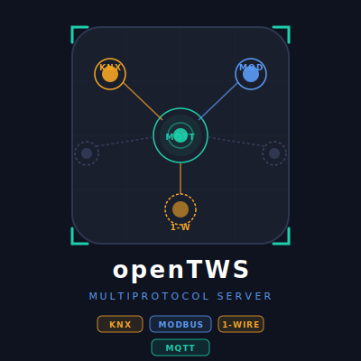

# openTWS



**Offene Gebäudeautomations-Plattform — verbindet KNX, Modbus, MQTT und mehr**

openTWS verbindet verschiedene Gebäudetechnik-Protokolle zu einem einheitlichen System. Alle Werte lassen sich über eine Weboberfläche überwachen, per Logik verknüpfen und über MQTT weitergeben — ohne proprietäre Konfigurationsdateien.

---

## Was kann openTWS?

| Funktion | Beschreibung |
|---|---|
| **Protokolle** | KNX/IP (Tunneling + Routing), Modbus TCP, Modbus RTU, 1-Wire, externes MQTT |
| **Mehrere Instanzen** | Beliebig viele Instanzen pro Protokoll (z. B. 2× KNX, 3× Modbus TCP) |
| **Protokoll-Brücke** | Ein KNX-Wert wird automatisch in ein Modbus-Register geschrieben — und umgekehrt |
| **Logik-Editor** | Visuelle Automatisierungslogik ohne Programmierung: 28 Blocktypen, Zeitpläne, Formeln, Python-Skripte, Benachrichtigungen, HTTP-Anfragen, Sonnenstand |
| **MQTT** | Stabiler UUID-Topic + lesbarer Alias-Topic; Retain-Unterstützung |
| **Weboberfläche** | Vollständige Bedienung über den Browser — kein separates Programm nötig |
| **Datenbank** | SQLite — keine externe Datenbank erforderlich |
| **Verlauf** | Werteverlauf mit Diagramm, Aggregation nach Zeit (Std / Tag / Woche …) |
| **Änderungsprotokoll** | Letzten N Wertänderungen einsehbar (RingBuffer) — aktualisiert sich live |
| **Alles sofort** | Änderungen greifen ohne Neustart |
| **Installation** | Docker Compose oder direkt als Python-Programm |
| **Lizenz** | MIT (kostenlos und quelloffen) |

---

## Inhaltsverzeichnis

1. [Schnellstart — Docker](#schnellstart--docker)
2. [Schnellstart — Direkt](#schnellstart--direkt)
3. [Konfiguration](#konfiguration)
4. [Wie funktioniert openTWS?](#wie-funktioniert-opentws)
5. [Datenpunkte](#datenpunkte)
6. [Verknüpfungen (Bindings)](#verknüpfungen-bindings)
7. [Suche](#suche)
8. [Adapter](#adapter)
9. [Verlauf (History)](#verlauf-history)
10. [Änderungsprotokoll (RingBuffer)](#änderungsprotokoll-ringbuffer)
11. [Sicherung & Wiederherstellung](#sicherung--wiederherstellung)
12. [Systemstatus](#systemstatus)
13. [Live-Verbindung (WebSocket)](#live-verbindung-websocket)
14. [Logik-Editor](#logik-editor)
15. [Adapter-Konfiguration](#adapter-konfiguration)
16. [MQTT-Topics](#mqtt-topics)
17. [Datentypen](#datentypen)
18. [Einstellungen](#einstellungen)
19. [Hilfsskripte](#hilfsskripte)
20. [Entwicklung](#entwicklung)

---

## Schnellstart — Docker

```bash
# 1. Herunterladen
git clone https://github.com/abeggled/opentws
cd opentws

# 2. Zugangsdaten einrichten
cp .env.example .env
# .env öffnen und mindestens setzen:
#   OPENTWS_JWT_SECRET        → zufällige Zeichenkette, min. 32 Zeichen
#   OPENTWS_MQTT_PASSWORD     → Passwort für den internen MQTT-Dienst — BITTE ÄNDERN!

# 3. Starten
docker compose up -d

# 4. Prüfen
curl http://localhost:8080/api/v1/system/health
# → {"status": "ok", "version": "0.1.0"}
```

**Standardzugang:** Benutzername `admin`, Passwort `admin`
⚠️ Das Passwort sofort nach der ersten Anmeldung ändern (Einstellungen → Passwort).

**Erreichbare Dienste:**

| Dienst | Adresse | Protokoll |
|---|---|---|
| openTWS Weboberfläche + API | http://localhost:8080 | HTTP |
| Mosquitto MQTT (intern) | localhost:1883 | MQTT |
| Mosquitto MQTT über WebSocket | localhost:9001 | MQTT/WS |

---

## Schnellstart — Direkt

**Voraussetzungen:** Python 3.11 oder neuer, laufender Mosquitto-Broker (oder anderer MQTT-Broker)

```bash
# 1. Herunterladen + virtuelle Umgebung anlegen
git clone https://github.com/abeggled/opentws
cd opentws
python -m venv .venv
source .venv/bin/activate        # Windows: .venv\Scripts\activate

# 2. Abhängigkeiten installieren
pip install -r requirements.txt

# 3. Konfigurieren
cp config.example.yaml config.yaml
# config.yaml anpassen: mqtt.host und security.jwt_secret setzen

# 4. Starten
python -m opentws
```

---

## Konfiguration

Die Konfiguration wird in dieser Reihenfolge geladen (höher = Vorrang):

1. Umgebungsvariablen (`OPENTWS_<ABSCHNITT>__<SCHLÜSSEL>`)
2. `config.yaml` (Pfad über `OPENTWS_CONFIG`, Standard: `./config.yaml`)
3. Eingebaute Standardwerte

```yaml
server:
  host: 0.0.0.0               # Netzwerkschnittstelle
  port: 8080                  # Port der Weboberfläche
  log_level: INFO             # Protokollstufe: DEBUG|INFO|WARNING|ERROR

mqtt:
  host: localhost             # Interner Mosquitto-Broker
  port: 1883
  username: null              # Zugangsdaten für internen Broker
  password: null

database:
  path: /data/opentws.db      # Datenbankdatei

ringbuffer:
  storage: disk               # Änderungsprotokoll: memory (RAM) oder disk (Datei)
  max_entries: 10000          # Maximale Anzahl Einträge

security:
  jwt_secret: changeme        # Sitzungsschlüssel — unbedingt ändern!
  jwt_expire_minutes: 1440    # Sitzungsdauer (Standard: 24 Stunden)
```

> **Hinweis:** Der `mqtt`-Abschnitt betrifft den **internen** Mosquitto-Broker. Externe MQTT-Broker werden als separate Adapter-Instanzen eingerichtet (siehe [MQTT-Adapter](#mqtt-adapter-externer-broker)).

---

## Wie funktioniert openTWS?

```
┌──────────────────────────────────────────────────────────────┐
│                        openTWS                               │
│                                                              │
│  ┌─────────────────────┐  Wertänderung  ┌─────────────────┐ │
│  │   Adapter-Instanzen │ ─────────────▶ │   Ereignisbus   │ │
│  │                     │ ◀── schreiben  │  (verteilt an   │ │
│  │  KNX, Modbus,       │                │  alle Abnehmer) │ │
│  │  MQTT, 1-Wire …     │                └──┬──────┬────────┘ │
│  └─────────────────────┘                   │      │         │
│                                     ┌──────▼─┐ ┌──▼──────┐ │
│                                     │ Werte- │ │ Verlauf │ │
│                                     │ Abbild │ │ RingBuf │ │
│                                     │        │ │ MQTT    │ │
│                                     └────────┘ │ WS      │ │
│                                                └─────────┘ │
│                                                             │
│  ┌───────────────────────────────────────────────────────┐  │
│  │                  Logik-Editor                         │  │
│  │  Wertänderung → Graph ausführen → DataPoint schreiben │  │
│  └───────────────────────────────────────────────────────┘  │
│                                                              │
│  ┌───────────────────────────────────────────────────────┐  │
│  │                   REST-API + WebSocket                │  │
│  └───────────────────────────────────────────────────────┘  │
└──────────────────────────────────────────────────────────────┘
```

**Kernprinzipien:**
- **Adapter** lesen Werte aus dem Gebäude (KNX-Telegramm, Modbus-Register, MQTT-Nachricht, …) und melden sie an den Ereignisbus.
- Der **Ereignisbus** verteilt jeden Wert gleichzeitig an: Werteabbild (aktueller Stand), Verlauf, Änderungsprotokoll, MQTT-Broker, WebSocket-Clients und den Logik-Editor.
- Der **Logik-Editor** reagiert auf Wertänderungen, führt Automatisierungslogiken aus und schreibt Ergebnisse zurück in DataPoints.
- **Protokoll-Brücke:** Wenn ein Wert über ein Protokoll empfangen wird, schreibt openTWS ihn automatisch über alle anderen verknüpften Protokolle weiter — ohne zusätzliche Konfiguration.

---

## Datenpunkte

Ein Datenpunkt ist das zentrale Objekt in openTWS. Jeder physische oder virtuelle Wert im System — eine Temperatur, ein Schaltzustand, ein Energiezähler — ist ein Datenpunkt.

```
GET    /api/v1/datapoints?page=0&size=50       # Liste (seitenweise)
POST   /api/v1/datapoints                      # Neu anlegen
GET    /api/v1/datapoints/{id}                 # Einzelnen laden (inkl. aktueller Wert)
PATCH  /api/v1/datapoints/{id}                 # Ändern
DELETE /api/v1/datapoints/{id}                 # Löschen (entfernt auch alle Verknüpfungen)
GET    /api/v1/datapoints/{id}/value           # Nur den aktuellen Wert
```

**Felder:**

| Feld | Beschreibung |
|---|---|
| `name` | Lesbarer Name, z. B. „Wohnzimmer Temperatur" |
| `data_type` | Datentyp: `BOOLEAN`, `INTEGER`, `FLOAT`, `STRING`, `DATE`, `TIME`, `DATETIME` |
| `unit` | Einheit, z. B. `°C`, `%rH`, `kWh`, `lx` |
| `tags` | Schlagwörter zum Gruppieren und Filtern |
| `persist_value` | Letzten Wert beim Neustart wiederherstellen (Standard: `true`) |
| `mqtt_topic` | Automatisch vergeben: `dp/{uuid}/value` |
| `mqtt_alias` | Lesbares Alias-Topic, z. B. `alias/klima/wohnzimmer/value` |

```bash
# Temperatur-Datenpunkt anlegen
curl -X POST http://localhost:8080/api/v1/datapoints \
  -H "Authorization: Bearer {token}" \
  -H "Content-Type: application/json" \
  -d '{
    "name": "Wohnzimmer Temperatur",
    "data_type": "FLOAT",
    "unit": "°C",
    "tags": ["klima", "wohnzimmer"]
  }'
```

---

## Verknüpfungen (Bindings)

Eine Verknüpfung verbindet einen Datenpunkt mit einer Adapter-Instanz und einer Adresse (z. B. KNX-Gruppenadresse oder Modbus-Register).

```
GET    /api/v1/datapoints/{id}/bindings
POST   /api/v1/datapoints/{id}/bindings
PATCH  /api/v1/datapoints/{id}/bindings/{binding_id}
DELETE /api/v1/datapoints/{id}/bindings/{binding_id}
```

**Richtungen:**

| Richtung | Bedeutung |
|---|---|
| `SOURCE` | Lesen: Adapter empfängt Werte und leitet sie an openTWS weiter |
| `DEST` | Schreiben: openTWS sendet Werte an den Adapter |
| `BOTH` | Beides gleichzeitig |

**Wert-Transformation (`value_formula`):**

Optional: eine Formel, die auf den Wert angewendet wird, bevor er ins System eingeht (SOURCE) oder herausgeht (DEST). Die Variable ist immer `x`.

```json
{ "value_formula": "x / 10" }
```

| Formel | Wirkung |
|---|---|
| `x * 3600` | Stunden → Sekunden |
| `x / 10` | Festkomma durch 10 |
| `round(x, 2)` | Auf 2 Dezimalstellen runden |
| `max(0, min(100, x))` | Auf 0–100 begrenzen |

Verfügbare Funktionen: `abs`, `round`, `min`, `max` und alle `math.*`-Funktionen. Division durch null und ungültige Ergebnisse werden abgefangen — der ursprüngliche Wert bleibt erhalten.

> **Hinweis:** `round()` verwendet mathematisches Runden (0.5 → aufrunden), nicht das in der Programmierung übliche „Bankers Rounding".

**Sendefilter** (nur für DEST/BOTH, werden der Reihe nach geprüft):

| Filter | Beschreibung |
|---|---|
| `send_throttle_ms` | Mindestabstand zwischen zwei Schreibvorgängen in Millisekunden |
| `send_on_change` | Nur senden wenn der Wert sich geändert hat |
| `send_min_delta` | Nur senden wenn die Abweichung zum letzten Wert mindestens so gross ist (absolut) |
| `send_min_delta_pct` | Nur senden wenn die Abweichung mindestens so gross ist (prozentual) |

**Beispiel: KNX-Temperatur → Modbus-Register**

```bash
# 1. Datenpunkt anlegen
DP_ID=$(curl -s -X POST http://localhost:8080/api/v1/datapoints \
  -H "Authorization: Bearer {token}" \
  -H "Content-Type: application/json" \
  -d '{"name":"Wohnzimmer Temperatur","data_type":"FLOAT","unit":"°C"}' \
  | jq -r .id)

# 2. KNX-Verknüpfung (Lesen von GA 1/2/3)
curl -X POST http://localhost:8080/api/v1/datapoints/$DP_ID/bindings \
  -H "Authorization: Bearer {token}" \
  -H "Content-Type: application/json" \
  -d '{"adapter_instance_id": "KNX-UUID", "direction": "SOURCE",
       "config": {"group_address": "1/2/3", "dpt_id": "DPT9.001"}}'

# 3. Modbus-Verknüpfung (Schreiben in Register 100)
curl -X POST http://localhost:8080/api/v1/datapoints/$DP_ID/bindings \
  -H "Authorization: Bearer {token}" \
  -H "Content-Type: application/json" \
  -d '{"adapter_instance_id": "MODBUS-UUID", "direction": "DEST",
       "config": {"unit_id": 1, "register_type": "holding", "address": 100, "data_format": "float32"}}'
```

---

## Suche

Servergestützte Suche über alle Datenpunkte. Gibt nie den gesamten Datenbestand zurück.

```
GET /api/v1/search?q=&tag=&type=&adapter=&page=0&size=50
```

| Parameter | Beschreibung |
|---|---|
| `q` | Suche im Namen |
| `tag` | Nach Schlagwort filtern |
| `type` | Nach Datentyp filtern (z. B. `FLOAT`) |
| `adapter` | Nach Protokoll filtern (z. B. `KNX`) |

---

## Adapter

Jeder Adapter-Typ kann in mehreren unabhängigen Instanzen betrieben werden. Alle Instanzen werden über die Weboberfläche oder die API verwaltet.

Die **Adapter-Konfiguration erfolgt vollständig über die Weboberfläche** — alle Felder werden aus dem JSON-Schema des jeweiligen Adapters dynamisch gerendert. Passwort-Felder erscheinen maskiert. Änderungen greifen sofort ohne Neustart.

```
GET    /api/v1/adapters/instances              # Alle Instanzen mit Status
POST   /api/v1/adapters/instances              # Neue Instanz anlegen
PATCH  /api/v1/adapters/instances/{id}         # Konfiguration ändern + neu verbinden
DELETE /api/v1/adapters/instances/{id}         # Stoppen + löschen
POST   /api/v1/adapters/instances/{id}/restart # Neu verbinden
POST   /api/v1/adapters/instances/{id}/test    # Verbindung testen

GET    /api/v1/adapters/{type}/schema          # JSON-Schema der Instanz-Konfiguration
GET    /api/v1/adapters/{type}/binding-schema  # JSON-Schema der Verknüpfungs-Konfiguration
```

### Anmeldung und Zugangsverwaltung

openTWS unterstützt zwei Anmeldemethoden:

| Methode | Verwendung |
|---|---|
| Benutzername + Passwort → JWT-Token | Weboberfläche, Browser |
| API-Schlüssel (`X-API-Key: opentws_…`) | Skripte, Automatisierungen |

```
POST   /api/v1/auth/login                              # Anmelden → Token erhalten
POST   /api/v1/auth/refresh                            # Token erneuern

GET    /api/v1/auth/users                              # Alle Benutzer (nur Admin)
POST   /api/v1/auth/users                              # Benutzer anlegen (nur Admin)
DELETE /api/v1/auth/users/{username}                   # Benutzer löschen (nur Admin)
POST   /api/v1/auth/me/change-password                 # Eigenes Passwort ändern

POST   /api/v1/auth/apikeys                            # API-Schlüssel anlegen
DELETE /api/v1/auth/apikeys/{id}                       # API-Schlüssel widerrufen

POST   /api/v1/auth/users/{username}/mqtt-password     # MQTT-Zugang einrichten
DELETE /api/v1/auth/users/{username}/mqtt-password     # MQTT-Zugang entziehen
```

**MQTT-Zugang:** Der interne Mosquitto-Broker ist passwortgeschützt. Jeder Benutzer kann einen separaten MQTT-Zugang (unabhängig vom Anmeldepasswort) erhalten, um sich direkt mit dem Broker zu verbinden.

---

## Verlauf (History)

Werteverlauf eines Datenpunkts — roh oder als Zusammenfassung.

```
GET /api/v1/history/{id}?from=&to=&limit=
GET /api/v1/history/{id}/aggregate?fn=avg&interval=1h&from=&to=
```

**Zusammenfassungsfunktionen:** `avg` (Durchschnitt), `min`, `max`, `last`

**Zeitintervalle:** `1m`, `5m`, `15m`, `30m`, `1h`, `6h`, `12h`, `1d`

Alle Zeitangaben richten sich nach der in den Einstellungen konfigurierten Zeitzone.

---

## Änderungsprotokoll (RingBuffer)

Der RingBuffer speichert die letzten N Wertänderungen als Protokoll. In der Weboberfläche aktualisiert sich die Liste **sofort** (ohne Neuladen), da neue Einträge live über die WebSocket-Verbindung übertragen werden.

```
GET  /api/v1/ringbuffer?q=&adapter=&from=&limit=   # Einträge abfragen
GET  /api/v1/ringbuffer/stats                       # Anzahl Einträge, Kapazität
POST /api/v1/ringbuffer/config                      # Speicherart + Kapazität ändern
```

Der Parameter `q` durchsucht sowohl den Namen als auch die ID des Datenpunkts.

---

## Sicherung & Wiederherstellung

Vollständige Konfigurationssicherung und -wiederherstellung. Bestehende Einträge werden aktualisiert, fehlende neu angelegt.

```
GET  /api/v1/config/export    # Sicherungsdatei herunterladen (JSON)
POST /api/v1/config/import    # Sicherungsdatei einspielen
```

Die Sicherung enthält: alle Datenpunkte, Verknüpfungen, Adapter-Instanzen und KNX-Gruppenadressen.

**KNX-Projektdatei importieren:**

```
POST /api/v1/knxproj/import   # .knxproj-Datei hochladen (multipart/form-data)
GET  /api/v1/knxproj/ga       # Importierte Gruppenadressen anzeigen
DELETE /api/v1/knxproj/ga     # Alle importierten Adressen löschen
```

Nach dem Import erscheinen die Gruppenadressen als Suchvorschläge im Verknüpfungs-Formular.

---

## Systemstatus

```
GET /api/v1/system/health      # Erreichbarkeit prüfen (kein Login nötig)
GET /api/v1/system/adapters    # Adapter-Status + Anzahl Verknüpfungen
GET /api/v1/system/datatypes   # Alle verfügbaren Datentypen
GET /api/v1/system/settings    # Systemeinstellungen lesen (z. B. Zeitzone)
PUT /api/v1/system/settings    # Systemeinstellungen ändern

GET /api/v1/adapters/knx/dpts  # Alle registrierten KNX-DPT-Typen auflisten
```

---

## Live-Verbindung (WebSocket)

Über die WebSocket-Verbindung werden Wertänderungen und neue RingBuffer-Einträge sofort an alle verbundenen Browser übertragen — kein manuelles Neuladen nötig.

```
WS /api/v1/ws?token={jwt}
```

**Datenpunkt abonnieren:**
```json
{"action": "subscribe", "datapoint_ids": ["uuid-1", "uuid-2"]}
```

**Eingehende Wertänderung:**
```json
{
  "id": "550e8400-e29b-41d4-a716-446655440000",
  "v": 21.4,
  "u": "°C",
  "t": "2026-03-27T10:23:41.123Z",
  "q": "good"
}
```

**Neuer RingBuffer-Eintrag** (an alle Verbindungen, ohne Abo):
```json
{
  "action": "ringbuffer_entry",
  "entry": {
    "ts": "2026-03-27T10:23:41.123Z",
    "datapoint_id": "550e8400-...",
    "name": "Wohnzimmer Temperatur",
    "new_value": 21.4,
    "old_value": 21.1,
    "quality": "good",
    "source_adapter": "KNX"
  }
}
```

**Datenqualität (`q`):**

| Wert | Bedeutung |
|---|---|
| `good` | Wert erfolgreich empfangen, Verbindung aktiv |
| `bad` | Adapter getrennt oder Lesefehler |
| `uncertain` | Verbindung wird wiederhergestellt oder Wert möglicherweise veraltet |

---

## Logik-Editor

### Übersicht

Der Logik-Editor ermöglicht das visuelle Erstellen von Automatisierungsregeln — ohne Programmierkenntnisse. Blöcke werden per Drag & Drop auf einer Arbeitsfläche platziert und mit Verbindungslinien verknüpft.

**Ablauf:**
1. Ein **DP Lesen**-Block beobachtet einen Datenpunkt.
2. Ändert sich der Wert, führt openTWS den gesamten Graphen aus.
3. Die Blöcke werden der Reihe nach berechnet.
4. Ein **DP Schreiben**-Block schreibt das Ergebnis zurück — das löst automatisch alle Adapter, MQTT, den Verlauf und den RingBuffer aus.
5. Der **Trigger**-Block löst den Graphen nach einem Zeitplan aus (z. B. täglich um 07:00 Uhr).

Der Graph kann auch manuell über den **▶ Ausführen**-Button gestartet werden.

**Zustände** (Hysterese, Statistik, Betriebsstunden) werden in der Datenbank gespeichert und überleben einen Neustart.

---

### Blocktypen

#### Konstante

| Block | Ausgänge | Beschreibung |
|---|---|---|
| **Festwert** | Wert | Gibt einen festen Wert aus — Zahl, Ein/Aus oder Text. |

#### Logik

| Block | Eingänge | Ausgänge | Beschreibung |
|---|---|---|---|
| **UND** | A, B | Aus | Wahr wenn **alle** Eingänge wahr sind. |
| **ODER** | A, B | Aus | Wahr wenn **mindestens ein** Eingang wahr ist. |
| **NICHT** | Ein | Aus | Kehrt den Eingang um. |
| **EXKLUSIV-ODER** | A, B | Aus | Wahr wenn **genau ein** Eingang wahr ist. |
| **Vergleich** | A, B | Ergebnis | Vergleicht zwei Werte. Auswahl: `>` `<` `=` `>=` `<=` `≠` |
| **Hysterese** | Wert | Aus | Schaltet ein wenn der Wert über „Schwelle EIN" steigt, und erst wieder aus wenn er unter „Schwelle AUS" fällt. Verhindert schnelles Hin- und Herschalten. |

#### Datenpunkt

| Block | Eingänge | Ausgänge | Beschreibung |
|---|---|---|---|
| **DP Lesen** | — | Wert, Geändert | Liest einen Datenpunkt. Löst den Graphen bei Wertänderung automatisch aus. Optionale Filter (Mindestabstand, Mindeständerung) und Wert-Transformation. |
| **DP Schreiben** | Wert, Trigger | — | Schreibt einen Wert in einen Datenpunkt. Optionaler Trigger-Eingang: nur schreiben wenn Trigger wahr. Optionale Filter und Wert-Transformation. |

#### Mathematik

| Block | Eingänge | Ausgänge | Beschreibung |
|---|---|---|---|
| **Formel** | a, b | Ergebnis | Berechnet einen Ausdruck aus den Eingängen `a` und `b`. Optional: eine zweite Formel zur Transformation des Ergebnisses (Variable `x`). |
| **Skalieren** | Wert | Ergebnis | Rechnet einen Wert von einem Bereich in einen anderen um, z. B. 0–255 → 0–100 %. |
| **Begrenzer** | Wert | Ergebnis | Begrenzt den Wert auf einen Bereich. Werte darunter oder darüber werden auf den Grenzwert gesetzt. |
| **Statistik** | Wert, Zurücksetzen | Min, Max, Mittelwert, Anzahl | Führt eine laufende Statistik über alle empfangenen Werte. Reset setzt alles zurück. Ergebnisse werden gespeichert und überleben einen Neustart. |

#### Timer

| Block | Eingänge | Ausgänge | Beschreibung |
|---|---|---|---|
| **Verzögerung** | Trigger | Trigger | Verzögert ein Signal um N Sekunden. |
| **Impuls** | Trigger | Aus | Gibt für N Sekunden „Wahr" aus, dann „Falsch". |
| **Trigger** | — | Trigger | Löst den Graphen nach einem Zeitplan aus (Cron-Format). Konfigurierbar über Vorlagen, einen visuellen Editor (Min/Std/Tag/Mon/Wochentag) oder direkte Eingabe des Ausdrucks. |
| **Betriebsstunden** | Aktiv, Zurücksetzen | Stunden | Zählt Betriebsstunden solange „Aktiv" wahr ist. Gespeicherter Zählerstand überlebt Neustarts. |

#### Skript

| Block | Eingänge | Ausgänge | Beschreibung |
|---|---|---|---|
| **Python-Skript** | a, b, c | Ergebnis | Führt Python-Code aus. Eingangswerte sind über `inputs['a']`, `inputs['b']`, `inputs['c']` verfügbar. Das Ergebnis wird mit `result = …` gesetzt. Nur mathematische Funktionen erlaubt — kein Dateizugriff, kein Netzwerk. |

#### KI

| Block | Eingänge | Ausgänge | Beschreibung |
|---|---|---|---|
| **KI-Logik** | Trigger | Ergebnis | Platzhalter für zukünftige KI-Integration. |

#### MCP

| Block | Eingänge | Ausgänge | Beschreibung |
|---|---|---|---|
| **MCP-Werkzeug** | Trigger, Eingabe | Ergebnis, Fertig | Ruft ein Werkzeug auf einem externen MCP-Server auf. |

#### Astro

| Block | Ausgänge | Beschreibung |
|---|---|---|
| **Astro Sonne** | Sonnenaufgang, Sonnenuntergang, Tagsüber | Berechnet Sonnenauf- und -untergang für den konfigurierten Standort. Gibt auch aus, ob es gerade hell ist. Konfiguration: Breitengrad, Längengrad. Berücksichtigt die eingestellte Zeitzone. |

#### Benachrichtigung

| Block | Eingänge | Ausgänge | Beschreibung |
|---|---|---|---|
| **Pushover** | Trigger, Nachricht | Gesendet | Sendet eine Push-Benachrichtigung auf das Handy via [Pushover](https://pushover.net). Konfiguration: App-Token, User-Key, Titel, Priorität. |
| **SMS (seven.io)** | Trigger, Nachricht | Gesendet | Sendet eine SMS via [seven.io](https://seven.io). Konfiguration: API-Schlüssel, Empfänger, Absender. |

#### Integration

| Block | Eingänge | Ausgänge | Beschreibung |
|---|---|---|---|
| **API-Abfrage** | Trigger, Inhalt | Antwort, Statuscode, Erfolg | Sendet eine HTTP-Anfrage an eine externe Adresse. Methode wählbar (GET/POST/PUT/PATCH/DELETE). Antwortformat: JSON oder Text. SSL-Prüfung konfigurierbar. |

---

### Filter und Transformation bei DP-Blöcken

Beide DataPoint-Blöcke haben drei Tabs: **Verbindung**, **Transformation** und **Filter**. Ein Punkt (•) erscheint im Tab wenn etwas aktiv ist.

#### Transformation

Optionale Formel die auf den Wert angewendet wird. Variable: `x`

Vordefinierte Vorlagen (Beispiele):

| Vorlage | Formel |
|---|---|
| × 1.000 | `x * 1000` |
| × 100 | `x * 100` |
| ÷ 10 | `round(x / 10, 1)` |
| ÷ 100 | `round(x / 100, 2)` |
| Sekunden → Stunden | `x / 3600` |
| Stunden → Sekunden | `x * 3600` |

#### Filter bei DP Lesen

| Filter | Beschreibung |
|---|---|
| Mindestabstand | Wie oft der Graph höchstens ausgelöst wird (z. B. maximal alle 10 Sekunden) |
| Nur bei Änderung | Graph nur auslösen wenn der Wert sich wirklich geändert hat |
| Mindeständerung (absolut) | Nur auslösen wenn der Wert sich um mindestens N geändert hat |
| Mindeständerung (%) | Nur auslösen wenn die Änderung mindestens N Prozent beträgt |

#### Filter bei DP Schreiben

| Filter | Beschreibung |
|---|---|
| Mindestabstand | Wie oft höchstens geschrieben wird |
| Nur bei Änderung | Nicht schreiben wenn der Wert gleich dem zuletzt geschriebenen ist |
| Mindeständerung (absolut) | Nur schreiben wenn der Wert sich um mindestens N geändert hat |

---

### Zeitplan-Konfiguration (Trigger-Block)

Der **Trigger**-Block löst Graphen nach einem Zeitplan aus. Drei Eingabewege, die sich gegenseitig synchronisieren:

**1. Vorlagen** — über 30 vordefinierte Zeitpläne in 4 Gruppen (Minuten-Intervalle, Stunden-Intervalle, Täglich, Wöchentlich/Monatlich)

**2. Visueller Editor** — fünf Felder: Minute / Stunde / Tag / Monat / Wochentag

**3. Direkteingabe** — Standard Cron-Ausdruck

```
0 7 * * *         → täglich um 07:00
*/15 * * * *      → alle 15 Minuten
0 8 * * 1-5       → werktags um 08:00
0 6,18 * * *      → täglich um 06:00 und 18:00
```

Zur Überprüfung: [crontab.guru](https://crontab.guru) (Link direkt im Konfigurations-Panel)

---

### Formel-Referenz

In **allen** Formelfeldern (DP Lesen, DP Schreiben, Formel-Block, Verknüpfungs-Transformation) gilt:

- Variable `x` = der eingehende Wert (immer als Zahl übergeben)
- Kein Import nötig — alle Funktionen direkt verfügbar
- `round()` verwendet mathematisches Runden (0.5 → aufrunden)

| Funktion | Beispiel | Beschreibung |
|---|---|---|
| `abs(x)` | `abs(x - 50)` | Absolutbetrag (immer positiv) |
| `round(x, n)` | `round(x, 2)` | Runden auf n Nachkommastellen |
| `min(a, b)` | `min(x, 100)` | Kleinerer der beiden Werte |
| `max(a, b)` | `max(x, 0)` | Grösserer der beiden Werte |
| `sqrt(x)` | `sqrt(x)` | Quadratwurzel |
| `floor(x)` | `floor(x)` | Abrunden auf ganze Zahl |
| `ceil(x)` | `ceil(x)` | Aufrunden auf ganze Zahl |
| `math.log(x)` | `math.log(x)` | Natürlicher Logarithmus |
| `math.sin(x)` | `math.sin(x)` | Sinus |
| `math.pi` | `x * math.pi / 180` | Kreiszahl π |

**Praktische Beispiele:**

| Ziel | Formel |
|---|---|
| Auf 0–100 begrenzen | `max(0, min(100, x))` |
| Fahrenheit → Celsius | `(x - 32) * 5 / 9` |
| Wh → kWh | `x / 1000` |
| Auf halbe Stufen runden | `round(x * 2) / 2` |
| Negativen Wert abschneiden | `max(0, x)` |

**Formel-Block** (Eingänge `a` und `b`):

```
a * 2 + b              # Eingang a verdoppeln, b addieren
max(a, b)              # Grösseren der beiden Werte nehmen
round((a + b) / 2, 1)  # Mittelwert, 1 Nachkommastelle
abs(a - b)             # Absolute Differenz
```

Zusätzlich kann eine **Ausgangs-Transformation** konfiguriert werden — eine zweite Formel (Variable `x`) die auf das berechnete Ergebnis angewendet wird.

---

### Automatische Typumwandlung

Die Logik-Engine wandelt Werte automatisch um:

| Von | Nach | Regel |
|---|---|---|
| `true`/`false` | Zahl | Wahr → 1.0, Falsch → 0.0 |
| Zahl | Ein/Aus | 0 → Falsch, alles andere → Wahr |
| Text `"123"` | Zahl | 123.0 |
| Text `"true"`, `"on"`, `"1"` | Ein/Aus | Wahr |
| Text `"false"`, `"off"`, `"0"` | Ein/Aus | Falsch |
| Kein Wert | Zahl | 0.0 |

Verbindungen zwischen unterschiedlichen Blocktypen funktionieren damit immer.

---

### Debug-Modus

Zeigt berechnete Zwischenwerte direkt auf den Blöcken an — live und automatisch.

1. Graph öffnen
2. **🔍 Debug**-Button in der Werkzeugleiste klicken
3. Jeder Block zeigt ein gelbes Band mit seinen aktuellen Ausgangswerten
4. Die Anzeige aktualisiert sich automatisch nach jeder Ausführung

| Typ | Darstellung |
|---|---|
| Wahr | `out=✓` |
| Falsch | `out=✗` |
| Zahl | `value=230.45` |
| DP Schreiben | `→ 21.5` |
| Kein Wert | `value=—` |

---

## Adapter-Konfiguration

### KNX-Adapter

**Instanz-Konfiguration:**

| Feld | Werte | Beschreibung |
|---|---|---|
| `connection_type` | `tunneling` / `routing` | Tunneling = direkte Verbindung zur Zentrale; Routing = IP-Multicast |
| `host` | IP-Adresse | IP der KNX/IP-Zentrale (Tunneling) oder Multicast-Adresse (Routing) |
| `port` | Standard `3671` | Port der KNX/IP-Zentrale (manche Geräte: `3674`) |
| `individual_address` | z. B. `1.1.210` | Eigene KNX-Adresse (Tunneling) |
| `local_ip` | IP-Adresse | Lokale Netzwerkschnittstelle (nur Routing, optional) |

**Verknüpfungs-Konfiguration:**

| Feld | Beschreibung |
|---|---|
| `group_address` | KNX-Gruppenadresse (dreiteilig, z. B. `27/6/6`) |
| `dpt_id` | DPT-Kennung — Tabelle unten |
| `state_group_address` | Optionale Rückmelde-Adresse für DEST-Verknüpfungen |
| `respond_to_read` | `true`: openTWS beantwortet KNX-Leseanfragen (GroupValueRead) mit dem aktuellen Wert. Standard: `false` |

**Unterstützte DPTs:**

openTWS unterstützt über 85 KNX-Datentypen. Die vollständige Liste ist über `GET /api/v1/adapters/knx/dpts` abrufbar.

**DPT 1 — 1-Bit Boolean**

| DPT | Typische Verwendung |
|---|---|
| `DPT1.001` | Schalten (Ein/Aus) |
| `DPT1.002` | Boolean |
| `DPT1.003` | Freigabe (Enable) |
| `DPT1.007` | Schritt/Richtung |
| `DPT1.008` | Auf/Ab |
| `DPT1.009` | Öffnen/Schliessen |
| `DPT1.010` | Start/Stopp |
| `DPT1.011` | Zustandsanzeige |
| `DPT1.017` | Auslöser (Trigger) |
| `DPT1.018` | Anwesenheit |
| `DPT1.019` | Fenster/Tür |
| `DPT1.021` | Szene A/B |
| `DPT1.022` | Jalousie-Modus |
| `DPT1.023` | Tag/Nacht |
| *(weitere DPT1.x)* | *1-Bit Steuerungen* |

**DPT 2 — 2-Bit Gesteuerter Wert**

| DPT | Typische Verwendung |
|---|---|
| `DPT2.001` | Schaltsteuerung (Priorität + Wert) |
| `DPT2.002` | Boolsche Steuerung |

**DPT 3 — 4-Bit Relativer Steuerwert**

| DPT | Typische Verwendung |
|---|---|
| `DPT3.007` | Dimmen (Richtung + Geschwindigkeit) |
| `DPT3.008` | Jalousie (Richtung + Geschwindigkeit) |

**DPT 4 — 1-Byte Zeichen**

| DPT | Grösse | Typ | Typische Verwendung |
|---|---|---|---|
| `DPT4.001` | 1 Byte | Text | ASCII-Zeichen |
| `DPT4.002` | 1 Byte | Text | ISO-8859-1-Zeichen |

**DPT 5 — 8-Bit Vorzeichenlos**

| DPT | Grösse | Typ | Typische Verwendung |
|---|---|---|---|
| `DPT5.001` | 1 Byte | Zahl (0–100 %) | Dimmen / Jalousie-Position |
| `DPT5.003` | 1 Byte | Zahl (0–360°) | Winkel |
| `DPT5.004` | 1 Byte | Ganzzahl (0–255) | Prozent (unsigned) |
| `DPT5.010` | 1 Byte | Ganzzahl | Zählerwert |

**DPT 6 — 8-Bit Vorzeichenbehaftet**

| DPT | Grösse | Typ | Typische Verwendung |
|---|---|---|---|
| `DPT6.001` | 1 Byte | Ganzzahl (−128…127) | Relativer Wert (%) |
| `DPT6.010` | 1 Byte | Ganzzahl | Impulszähler (vorzeichenbehaftet) |

**DPT 7 — 16-Bit Vorzeichenlos**

| DPT | Grösse | Typ | Typische Verwendung |
|---|---|---|---|
| `DPT7.001` | 2 Byte | Ganzzahl (0–65535) | Impulszähler |
| `DPT7.002` | 2 Byte | Ganzzahl | Zeitraum (ms) |
| `DPT7.003` | 2 Byte | Ganzzahl | Zeitraum (10 ms) |
| `DPT7.004` | 2 Byte | Ganzzahl | Zeitraum (100 ms) |
| `DPT7.005` | 2 Byte | Ganzzahl | Zeitraum (s) |
| `DPT7.006` | 2 Byte | Ganzzahl | Zeitraum (min) |
| `DPT7.007` | 2 Byte | Ganzzahl | Zeitraum (h) |
| `DPT7.011` | 2 Byte | Ganzzahl | Länge (mm) |
| `DPT7.012` | 2 Byte | Ganzzahl | Stromstärke (mA) |
| `DPT7.013` | 2 Byte | Ganzzahl | Helligkeit (lx) |
| `DPT7.600` | 2 Byte | Ganzzahl | Farbtemperatur (K) |

**DPT 8 — 16-Bit Vorzeichenbehaftet**

| DPT | Grösse | Typ | Typische Verwendung |
|---|---|---|---|
| `DPT8.001` | 2 Byte | Ganzzahl | Impulszähler (vorzeichenbehaftet) |
| `DPT8.002` | 2 Byte | Ganzzahl | Zeitraum (ms) |
| `DPT8.005` | 2 Byte | Ganzzahl | Zeitraum (s) |
| `DPT8.010` | 2 Byte | Ganzzahl | Drehzahl-Differenz (1/min) |
| `DPT8.011` | 2 Byte | Ganzzahl | Prozent-Differenz |
| `DPT8.012` | 2 Byte | Ganzzahl | Rotationswinkel (°) |

**DPT 9 — 2-Byte KNX-Gleitkomma (EIS5)**

| DPT | Typische Verwendung |
|---|---|
| `DPT9.001` | Temperatur (°C) |
| `DPT9.002` | Temperaturdifferenz (K) |
| `DPT9.003` | Kelvin/Stunde (K/h) |
| `DPT9.004` | Windgeschwindigkeit (m/s) |
| `DPT9.005` | Luftdruck (Pa) |
| `DPT9.006` | Luftfeuchtigkeit (%) |
| `DPT9.007` | Luftfeuchtigkeit (% rH) |
| `DPT9.008` | CO₂-Konzentration (ppm) |
| `DPT9.009` | Spannung (mV) |
| `DPT9.010` | Leistung (W) |
| `DPT9.011` | Zeit (s) |
| `DPT9.020` | Spannung (mV) |
| `DPT9.021` | Strom (mA) |
| `DPT9.024` | Leistung (kW) |
| `DPT9.025` | Volumenfluss (l/h) |
| `DPT9.026` | Niederschlag (l/m²) |
| `DPT9.027` | Luftdruck (Pa) |
| `DPT9.028` | Luftdruck (Pa) |
| `DPT9.029` | Luftdruck (Pa) |
| `DPT9.030` | Einstrahlungsdichte (W/m²) |

**DPT 10, 11 — Uhrzeit und Datum**

| DPT | Grösse | Typ | Typische Verwendung |
|---|---|---|---|
| `DPT10.001` | 3 Byte | Text `HH:MM:SS` | Uhrzeit (inkl. Wochentag) |
| `DPT11.001` | 3 Byte | Text `JJJJ-MM-TT` | Datum |

**DPT 12, 13 — 32-Bit Integer**

| DPT | Grösse | Typ | Typische Verwendung |
|---|---|---|---|
| `DPT12.001` | 4 Byte | Ganzzahl (0–4 Mrd.) | Energiezähler (vorzeichenlos) |
| `DPT13.001` | 4 Byte | Ganzzahl (±2 Mrd.) | Impulszähler (vorzeichenbehaftet) |
| `DPT13.010` | 4 Byte | Ganzzahl | Wirkenergie (Wh) |
| `DPT13.013` | 4 Byte | Ganzzahl | Wirkenergie (kWh) |

**DPT 14 — 32-Bit IEEE-754-Gleitkomma (physikalische Grössen)**

| DPT | Typische Verwendung |
|---|---|
| `DPT14.000` | Beschleunigung (m/s²) |
| `DPT14.005` | Winkelgeschwindigkeit (rad/s) |
| `DPT14.007` | Fläche (m²) |
| `DPT14.012` | Kapazität (F) |
| `DPT14.017` | Dichte (kg/m³) |
| `DPT14.019` | Elektrischer Strom (A) |
| `DPT14.020` | Elektrische Feldstärke (V/m) |
| `DPT14.023` | Elektrisches Potential (V) |
| `DPT14.024` | Elektrische Spannung (V) |
| `DPT14.027` | Energie (J) |
| `DPT14.028` | Kraft (N) |
| `DPT14.029` | Frequenz (Hz) |
| `DPT14.033` | Wärmestrom (W) |
| `DPT14.039` | Länge (m) |
| `DPT14.046` | Lichtstrom (lm) |
| `DPT14.050` | Masse (kg) |
| `DPT14.055` | Leistung (W) |
| `DPT14.056` | Leistungsfaktor |
| `DPT14.058` | Druck (Pa) |
| `DPT14.065` | Widerstand (Ω) |
| `DPT14.066` | Winkelauflösung (°) |
| `DPT14.067` | Drehzahl (1/min) |
| `DPT14.068` | Geschwindigkeit (m/s) |
| `DPT14.069` | Drehmoment (Nm) |
| `DPT14.070` | Volumen (m³) |
| `DPT14.071` | Volumenfluss (m³/s) |
| `DPT14.075` | Scheinleistung (VA) |
| *(weitere DPT14.x)* | *Physikalische Mess­grössen* |

**DPT 16, 17, 18, 19 — Text, Szenen, Datum/Zeit**

| DPT | Grösse | Typ | Typische Verwendung |
|---|---|---|---|
| `DPT16.000` | 14 Byte | Text | ASCII-Text (14 Zeichen) |
| `DPT16.001` | 14 Byte | Text | ISO-8859-1-Text (14 Zeichen) |
| `DPT17.001` | 1 Byte | Ganzzahl | Szenennummer (0–63) |
| `DPT18.001` | 1 Byte | Ganzzahl | Szenen-Steuerung (inkl. Lernmodus) |
| `DPT19.001` | 8 Byte | ISO-8601-Text | Datum und Uhrzeit |

**DPT 20 — 1-Byte Enum/Modus**

| DPT | Typische Verwendung |
|---|---|
| `DPT20.001` | HVAC-Modus (Auto/Komfort/Standby/Nacht/Schutz) |
| `DPT20.002` | HVAC-Brennermodus |
| `DPT20.003` | HVAC-Gebläsemodus |
| `DPT20.004` | HVAC-Mastermodus |
| `DPT20.005` | HVAC-Statusmeldung |
| `DPT20.006` | HVAC-Positionswert |
| `DPT20.007` | DALI-Verblend-Modus |
| `DPT20.008` | Steuerungsverhalten |
| `DPT20.011` | Priorität |
| `DPT20.012` | Lichtsteuermodus |
| `DPT20.013` | Heizungsregelungsmodus |
| `DPT20.017` | Belüftungsmodus |
| `DPT20.020` | Alarmschwere |
| `DPT20.021` | Testmodus |
| `DPT20.100` | Gebäude-Betriebsmodus |
| `DPT20.102` | Aktiver Grundmodus |
| `DPT20.105` | Warmwasser-Modus (DHW) |
| `DPT20.111` | Heizklima-Modus |
| `DPT20.113` | Zeitprogramm |
| `DPT20.600` | Ventilator-Modus |
| `DPT20.601` | Heizungstyp |
| `DPT20.602` | Klappenventil-Modus |
| `DPT20.603` | Heizkreis-Modus |
| `DPT20.604` | Heizkörpermodus |
| *(weitere DPT20.x)* | *1-Byte Enums/Modi* |

**DPT 29 — 64-Bit Integer (Smart Metering)**

| DPT | Grösse | Typ | Typische Verwendung |
|---|---|---|---|
| `DPT29.010` | 8 Byte | Ganzzahl | Wirkenergie (Wh), hochauflösend |
| `DPT29.011` | 8 Byte | Ganzzahl | Scheinenergie (VAh) |
| `DPT29.012` | 8 Byte | Ganzzahl | Blindenergie (VARh) |

**DPT 219, 240 — Spezielle Typen**

| DPT | Grösse | Typ | Typische Verwendung |
|---|---|---|---|
| `DPT219.001` | 2 Byte | Ganzzahl | AlarmInfo (Modus + Statusbits) |
| `DPT240.800` | 3 Byte | JSON-Text | Jalousie-Kombination (Höhe % + Lamellen %) |

> **Hinweis für KNX-Dimmer:** Zwei separate Verknüpfungen anlegen — eine DEST für die Schreib-Adresse, eine SOURCE für die Rückmelde-Adresse.

---

### Modbus-TCP-Adapter

**Instanz-Konfiguration:**

| Feld | Standard | Beschreibung |
|---|---|---|
| `host` | — | IP-Adresse der Modbus-Gegenstelle |
| `port` | `502` | TCP-Port |
| `timeout` | `3.0` | Verbindungs-Timeout in Sekunden |

**Verknüpfungs-Konfiguration:**

| Feld | Werte | Beschreibung |
|---|---|---|
| `unit_id` | `1` | Modbus-Slave-ID (Geräteadresse) |
| `register_type` | `holding`, `input`, `coil`, `discrete_input` | Registertyp |
| `address` | Ganzzahl | Registeradresse (0-basiert) |
| `count` | `1` | Anzahl zu lesender Register |
| `data_format` | `uint16`, `int16`, `uint32`, `int32`, `float32`, `uint64`, `int64` | Datenformat |
| `scale_factor` | `1.0` | Rohwert × Faktor = Messwert |
| `byte_order` | `big` / `little` | Byte-Reihenfolge im Register |
| `word_order` | `big` / `little` | Wort-Reihenfolge bei 32/64-Bit-Werten |
| `poll_interval` | `1.0` | Abfrageintervall in Sekunden (nur SOURCE/BOTH) |

> **Praxistipp:** Die meisten Steuerungen (Siemens, Beckhoff …) verwenden `big`/`big`. Bei offensichtlich falschem Wert zuerst `word_order` auf `little` wechseln.

---

### Modbus-RTU-Adapter

Gleiche Verknüpfungs-Konfiguration wie TCP. Zusätzliche Instanz-Felder: `port` (z. B. `/dev/ttyUSB0`), `baudrate`, `parity`, `stopbits`, `bytesize`, `timeout`.

---

### 1-Wire-Adapter

Liest Temperatursensoren über den Linux-Systemordner (`/sys/bus/w1/…`). Auf Windows funktioniert der Adapter nicht, startet aber ohne Fehlermeldung.

**Instanz-Konfiguration:**

| Feld | Standard | Beschreibung |
|---|---|---|
| `poll_interval` | `30.0` | Abfrageintervall in Sekunden |
| `w1_path` | `/sys/bus/w1/devices` | Pfad zum 1-Wire-Systemordner |

**Verknüpfungs-Konfiguration:**

| Feld | Beschreibung |
|---|---|
| `sensor_id` | Sensor-ID, z. B. `28-0000012345ab` |
| `sensor_type` | Sensortyp, z. B. `DS18B20` (Standard) |

Verfügbare Sensor-IDs können über den Verbindungstest abgerufen werden.

---

### MQTT-Adapter (externer Broker)

Verbindet sich mit einem **externen** MQTT-Broker (getrennt vom internen Mosquitto).

**Instanz-Konfiguration:** `host`, `port`, `username`, `password`

**Verknüpfungs-Konfiguration:**

| Feld | Beschreibung |
|---|---|
| `topic` | Topic zum Empfangen (SOURCE/BOTH) |
| `publish_topic` | Topic zum Senden (DEST/BOTH) — Standard: gleich wie `topic` |
| `retain` | Retain-Flag beim Senden setzen |

---

## MQTT-Topics

openTWS verwendet zwei parallele Topic-Strategien:

| Topic | Beschreibung |
|---|---|
| `dp/{uuid}/value` | Stabil — ändert sich nie, sicher für Automatisierungen. Mit Retain gespeichert. |
| `dp/{uuid}/set` | Auf diesen Topic schreiben um einen Wert zu setzen |
| `dp/{uuid}/status` | Verbindungsstatus des Adapters (mit Retain) |
| `alias/{tag}/{name}/value` | Lesbar und durchsuchbar (nur wenn `mqtt_alias` gesetzt) |

**Nachrichtenformat (`dp/{uuid}/value`):**

```json
{ "v": 21.4, "u": "°C", "t": "2026-03-27T10:23:41.123Z", "q": "good" }
```

| Schlüssel | Bedeutung |
|---|---|
| `v` | Wert |
| `u` | Einheit |
| `t` | Zeitstempel (ISO 8601) |
| `q` | Qualität: `good` / `bad` / `uncertain` |

**Wert setzen:**
```bash
mosquitto_pub -t "dp/550e8400-.../set" -m '{"v": 22.5}'
```

---

## Datentypen

| Typ | Beschreibung | MQTT-Format |
|---|---|---|
| `BOOLEAN` | Ein/Aus | `true` / `false` |
| `INTEGER` | Ganze Zahl | Zahl |
| `FLOAT` | Dezimalzahl | Zahl |
| `STRING` | Text | Zeichenkette |
| `DATE` | Datum | `JJJJ-MM-TT` |
| `TIME` | Uhrzeit | `HH:MM:SS` |
| `DATETIME` | Datum und Uhrzeit | ISO 8601 mit Zeitzone |
| `UNKNOWN` | Unbekannt | Hexadezimal-Text |

Typumwandlungen sind verlustfrei wo möglich — bei Verlust wird eine Meldung ins Protokoll geschrieben.

---

## Einstellungen

Die Einstellungen sind über die Weboberfläche erreichbar (⚙ in der Seitenleiste).

**Allgemein:**
- **Zeitzone** — alle Zeitangaben in der Oberfläche werden in dieser Zeitzone dargestellt (Verlauf, RingBuffer, History-Suche, Astro-Block)
- **KNX-Projektdatei importieren** — ETS-Projektdatei (`.knxproj`) hochladen, um Gruppenadressen als Suchvorschläge im Verknüpfungs-Formular zu nutzen

**Passwort:** Eigenes Anmeldepasswort ändern

**Benutzer** (nur Administratoren): Benutzer anlegen, löschen, MQTT-Zugang verwalten

**API-Schlüssel:** Schlüssel für die Anbindung externer Systeme erstellen und widerrufen

**Sicherung:** Vollständige Konfiguration herunterladen oder einspielen

---

## Hilfsskripte

### Import-EtsGaCsv.ps1 — ETS-GA-Export importieren

Das Skript `scripts/Import-EtsGaCsv.ps1` liest einen ETS-GA-CSV-Export und legt je Gruppenadresse
automatisch einen DataPoint mit passendem Typ und Einheit an. Anschliessend wird eine
Verknüpfung zur angegebenen KNX-Adapter-Instanz erstellt.

**Voraussetzungen:** PowerShell 5.1 oder neuer, erreichbare openTWS-Instanz, gültiger API-Schlüssel.

**Parameter:**

| Parameter | Pflicht | Beschreibung |
|---|---|---|
| `-Url` | ja | Basis-URL der openTWS-Instanz, z.B. `http://localhost:8080` |
| `-ApiKey` | ja | API-Schlüssel (`opentws_…`) |
| `-File` | ja | Pfad zur ETS-GA-CSV-Datei |
| `-Adapter` | ja | Name der KNX-Adapter-Instanz in openTWS |
| `-LogFile` | nein | Pfad für Fehlerprotokoll; ohne Angabe werden Fehler auf der Konsole ausgegeben |
| `-Direction` | nein | Verknüpfungsrichtung: `SOURCE` (Standard), `DEST` oder `BOTH` |
| `-Encoding` | nein | Zeichenkodierung der CSV-Datei: `UTF8` (Standard) oder `Default` (ANSI/Windows-1252). ETS 5 exportiert i.d.R. ANSI, ETS 6 UTF-8. |

**CSV-Format (ETS 5/6 GA-Export):**

Der Export erfolgt in ETS über *Gruppenadressliste exportieren → CSV*. Das Skript erkennt Semikolon- und
Komma-Trennzeichen sowie deutschsprachige und englischsprachige Spaltenköpfe automatisch.

```
"Group name";"Address";"Central";"Unfiltered";"Description";"Comment";"DatapointType";"Security"
"Wohnzimmer Temperatur";"1/1/1";"";"";"";"";DPST-9-1;Auto
"Wohnzimmer Helligkeit";"1/1/2";"";"";"";"";DPST-9-2;Auto
"Rolllade EG Auf/Ab";"1/2/1";"";"";"";"";DPST-1-8;Auto
```

DPT-Angaben im Format `DPST-X-Y` (Haupt- und Subtyp) oder `DPT-X` (nur Haupttyp) werden
automatisch in das openTWS-Format (`DPT9.001`) umgewandelt und der passende Datentyp (`FLOAT`,
`INTEGER`, `BOOLEAN`, `STRING`) sowie die Einheit werden gesetzt. Fehlt der DPT, wird `FLOAT`
ohne Einheit verwendet.

**Beispiel:**

```powershell
.\scripts\Import-EtsGaCsv.ps1 `
    -Url    http://localhost:8080 `
    -ApiKey opentws_abc123 `
    -File   C:\Projekte\GA_Export.csv `
    -Adapter "KNX/IP"
```

ETS 5 (ANSI-Kodierung):

```powershell
.\scripts\Import-EtsGaCsv.ps1 `
    -Url      http://localhost:8080 `
    -ApiKey   opentws_abc123 `
    -File     C:\Projekte\GA_Export.csv `
    -Adapter  "KNX/IP" `
    -Encoding Default
```

Mit Fehlerprotokoll:

```powershell
.\scripts\Import-EtsGaCsv.ps1 `
    -Url     http://localhost:8080 `
    -ApiKey  opentws_abc123 `
    -File    C:\Projekte\GA_Export.csv `
    -Adapter "KNX/IP" `
    -LogFile C:\Projekte\import_errors.log
```

Das Skript läuft bei Einzelfehlern durch. Am Ende werden Anzahl der erfolgreich importierten,
übersprungenen (Zeilen ohne Adresse) und fehlgeschlagenen GAs ausgegeben.

---

## Entwicklung

### Starten ohne Docker

```bash
# Mosquitto (temporär)
docker run -d -p 1883:1883 eclipse-mosquitto:2

# Konfiguration
cp config.example.yaml config.yaml

# Server mit automatischem Neustart bei Codeänderungen
uvicorn opentws.main:create_app --factory --reload --host 0.0.0.0 --port 8080
```

### Datenbankstruktur

Die Datenbank wird automatisch aktualisiert — jede neue Version fügt fehlende Tabellen und Spalten hinzu, ohne bestehende Daten zu verlieren. Aktuelle Version: **V15**.

| Tabelle | Inhalt |
|---|---|
| `datapoints` | Alle Datenpunkte (inkl. `persist_value`-Flag) |
| `adapter_bindings` | Verknüpfungen zwischen Datenpunkten und Adaptern |
| `adapter_instances` | Adapter-Instanzen |
| `users` | Benutzerkonten |
| `api_keys` | API-Schlüssel (nur als Hashwert gespeichert) |
| `history_values` | Werteverlauf |
| `logic_graphs` | Logik-Graphen (inkl. gespeichertem Block-Zustand) |
| `app_settings` | Systemeinstellungen (z. B. Zeitzone) |
| `datapoint_last_values` | Letzter bekannter Wert je Datenpunkt — wird beim Start wiederhergestellt |

---

## Lizenz

MIT — kostenlos und quelloffen.
